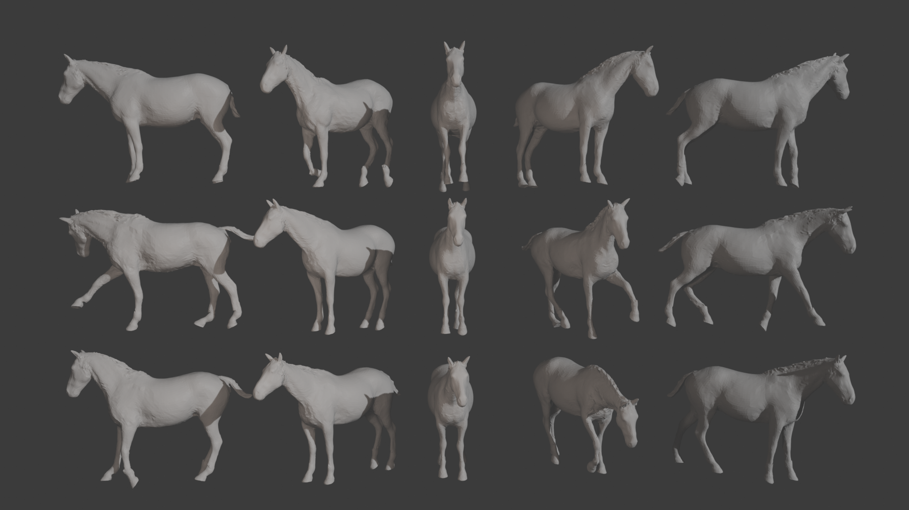

# 🐎 VARENPoser: Variational Horse Pose Prior
This repository contains the code for the VARENPoser model. A VAE trained on diverse VAREN poses. 


Based on [VPoser](https://github.com/nghorbani/human_body_prior/)
[ [Project Page](https://varen.is.tue.mpg.de/) ]


 


---

## TO DOS:
- [ ] Fill out this README
- [x] Figure out and share full environment
- [x] Make checkpoint publically available (On project page)
- [x] Clean up code
- [x] Create read-to-use model (remove loss functions, auto-load checkpoint etc)

## License
Software Copyright License for non-commercial scientific research purposes. Please read carefully the [terms and conditions](LICENSE) and any accompanying documentation before you download and/or use the model, data and software, (the "Model & Software"), including 3D meshes, blend weights, blend shapes, textures, software, scripts, and animations. By downloading and/or using the Model & Software (including downloading, cloning, installing, and any other use of this github repository), you acknowledge that you have read these terms and conditions, understand them, and agree to be bound by them. If you do not agree with these terms and conditions, you must not download and/or use the Model & Software. Any infringement of the terms of this agreement will automatically terminate your rights under this [License](LICENSE).

## Description

Parametric 3D models driven by joints, typically suffer from the fact that joints are defined simply as rotation matrices with full 360-degrees of freedom. This often results in estimated poses that are simply not congruent with real-life physics. The VAREN model is not immune to these problems. To mitigate this, this repo provides a **VAE-based Pose-Prior**, capturing a very large pose space, across almost 1 million unique poses. The VAE takes as input a pose, and attempts to recreate it from the learned pose-space, effectively **regularising** unnatural poses into poses that are more plausible.

Additionally, this model allows for **sampling** from the learned pose-space - giving access to **realistic** poses without the need for extensive data capture and alignment procedures.

## Environment
This is a light-weight repo, so that it can be easily integrated into other codebases. 
The main requirements for using the model are just PyTorch and VAREN. Additional dependencies include tqdm for training / loading the data, and trimesh for visualisations/example scripts. 

They can all be installed via 
```
pip install -r requirements.txt
```

### Known Issues:
Currently, with trimesh version 4.6, there is a bug in which mesh face colours are not properly applied. Simply downgrade trimesh as a work around. This will likely be fixed in the near future (by Trimesh).
Additionally, pyglet may need to be installed and/or downgraded to a version <2.0. 


## Downloading the Checkpoints
Download of the checkpoint can be found [here](https://varen.is.tue.mpg.de/download.php). Please sign up / log in to download. The download can be found on the downloads page under VAREN Poser (VarenPoser.pth)

## Contact

The code of this repo was implemented by [Dennis Perrett](dennis.perrett@tuebingen.mpg.de).

For questions on this implementation, please contact [Dennis](dennis.perrett@tuebingen.mpg.de) directly, or for questions on the model and its abstract implementation, please contact [Silvia Zuffi](silvia.zuffi@tuebingen.mpg.de)