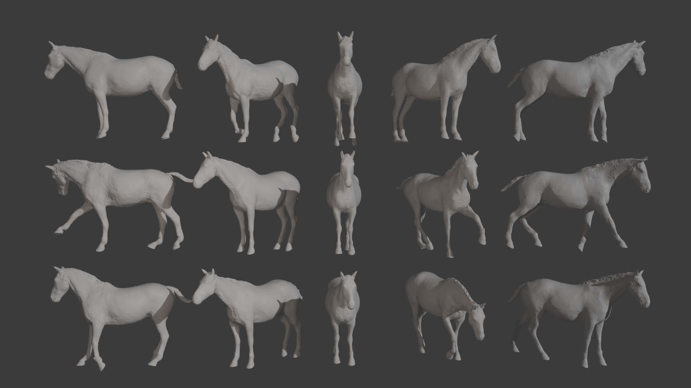

# Quadruped Pose Prior

A VAE-based pose prior for quadruped body models. The model learns a compact
latent representation of plausible body poses from large-scale motion-capture
and scan-registration data, and can be used either to **regularise** noisy or
physically implausible poses, or to **sample** novel realistic poses directly
from the learned distribution.



---

## Overview

Parametric 3D body models typically represent joints as unconstrained rotation
matrices, giving each joint a full 360° of freedom. This means that fitting or
optimisation procedures can easily produce poses that are physically impossible
— limbs bent the wrong way, unnatural torsions, etc.

This repository provides a **VAE-based pose prior** that mitigates this problem.
The encoder maps a full-body axis-angle pose into a 32-dimensional Gaussian
latent space. The decoder reconstructs a pose from any point in that space.
Because the latent space is trained on near-1-million real poses, any pose
decoded from it will be plausible.

Two use-cases:

| Use-case | What it does |
|---|---|
| **Regularisation** | Projects an arbitrary noisy pose onto the nearest plausible pose in the learned distribution. |
| **Sampling** | Draws novel poses directly from the prior — useful for data augmentation or visualisation. |

---

## Installation

The model has minimal dependencies and is designed to integrate easily into
other codebases.

```bash
pip install -r requirements.txt
```

**Known issues:**
- Trimesh ≥ 4.6 has a bug where mesh face colours are not applied correctly.
  Downgrade trimesh as a workaround.
- Pyglet may need to be downgraded to `< 2.0` for the visualisation scripts.

---

## Downloading the Checkpoint

Download the pre-trained checkpoint from the
[project page](https://varen.is.tue.mpg.de/download.php) (login required).
The file is listed under **VAREN Poser** → `VarenPoser.pth`.

---

## Quick Start

### Sampling new poses

```python
import torch
from varen_poser.models.pose_prior import QuadrupedPosePrior

# Load the model
model = QuadrupedPosePrior().eval()
checkpoint = torch.load("VarenPoser.pth", weights_only=False)
model.load_state_dict(checkpoint, strict=False)

# Sample 10 poses at default temperature
result = model.sample_poses(num_poses=10)
poses = result["pose_body"]          # (10, 38, 3)  axis-angle per joint
matrots = result["pose_body_matrot"] # (10, 38, 9)  rotation matrices (flattened)
```

### Regularising an existing pose

```python
# full_pose: (B, 114) — 38 joints × 3 axis-angle values
regularised = model.regularise_pose(full_pose)
```

The global z-rotation (heading) is stripped before regularisation and restored
afterwards, so the animal's facing direction is preserved.

### Encoding / decoding manually

```python
# Encode a pose into the latent space
q_z = model.encode(pose_body)   # returns a torch.distributions.Normal
z   = q_z.mean                  # (B, 32) deterministic latent code

# Decode a latent vector
out = model.decode(z)
```

---

## Example Scripts

Run from the repository root with `python -m example_scripts.<script_name>`.

### Generate and view samples

```bash
python -m example_scripts.sample_VAE \
    --varen_model_path /path/to/varen \
    --checkpoint_path  /path/to/VarenPoser.pth \
    --num_samples 5 \
    --temperature 1.0 \
    --save_samples
```

### Visualise the latent space

```bash
python -m example_scripts.visualise_pose_space \
    --varen_model_path /path/to/varen \
    --checkpoint_path  /path/to/VarenPoser.pth \
    --save_samples
```

Each of the 32 latent dimensions is swept from −2σ to +2σ; the resulting meshes
are saved as `.ply` files.

### Regularisation demo

```bash
python -m example_scripts.regularisation_example \
    --varen_model_path /path/to/varen \
    --checkpoint_path  /path/to/VarenPoser.pth \
    --num_samples 6
```

---

## Code Structure

```
varen_poser/
├── models/
│   ├── components.py        # Neural network building blocks
│   │                          (BatchFlatten, OrthoRotDecoder, LatentDistHead)
│   ├── pose_prior.py        # QuadrupedPosePrior  — the core VAE
│   └── trainer.py           # QuadrupedPosePriorTrainer  — adds loss + mesh utils
│
├── datasets/
│   ├── varen_pose_dataset.py  # VarenMoCapData, VarenMuscles  (PyTorch Datasets)
│
└── utils/
    ├── rot_conversions.py   # Low-level axis-angle ↔ rotation matrix (Rodrigues)
    ├── pose_transforms.py   # High-level pose helpers (aa2matrot, remove_rotation_from_axis …)
    ├── losses.py            # GeodesicRotationLoss
    ├── logging_utils.py     # create_logger, get_new_log_dir
    └── example_utils.py     # load_model, generate_poses, create_meshes, save_samples
```

### Model architecture

```
Input pose  (B, 114)   ← 38 joints × 3 axis-angle values
      │
  BatchNorm → Linear(512) → LeakyReLU → BatchNorm → Dropout
      │     → Linear(512) → Linear(512)
      │
  LatentDistHead → Normal(μ, σ)  shape (B, 32)
      │
    rsample()  ← reparameterisation trick
      │
  Linear(512) → LeakyReLU → Dropout → Linear(512) → LeakyReLU
      │       → Linear(228)
      │
  OrthoRotDecoder  ← Gram-Schmidt orthonormalisation on 6D representation
      │
Output  pose_body  (B, 38, 3)   axis-angle
        pose_body_matrot  (B, 38, 9)   rotation matrices
```

### Training loss

| Component | Weight | Description |
|---|---|---|
| KL divergence | 0.005 | `KL(q(z|x) ‖ N(0,I))` — regularises the latent space |
| Vertex L1 | 4 | Mean absolute vertex distance between original and reconstructed mesh |
| Geodesic rotation | 2 | Mean geodesic angle between predicted and ground-truth rotation matrices |
| Joint L1 | 2 | Mean absolute joint-position distance |

---

## Training

```bash
python train_VAE.py \
    --varen_model_path /path/to/varen \
    --dataset_path     /path/to/data \
    --train_batch_size 2048 \
    --lr 1e-5
```

Checkpoints and mesh visualisations are saved to a timestamped directory under
`./logs/`. Resume training from a checkpoint with `--checkpoint /path/to/ckpt.pth`.

---

## Contact

Implemented by [Dennis Perrett](mailto:dennis.perrett@tuebingen.mpg.de).

For questions about this codebase contact Dennis directly.
For questions about the underlying body model, contact
[Silvia Zuffi](mailto:silvia.zuffi@tuebingen.mpg.de).

---

## License

Software Copyright License for non-commercial scientific research purposes.
Please read the [terms and conditions](LICENSE) carefully before downloading
or using this software.
